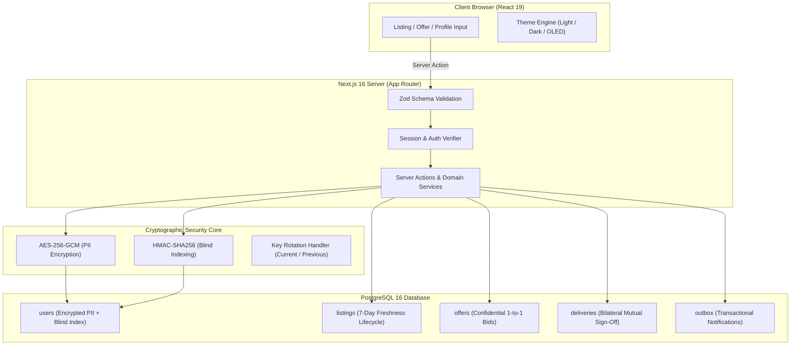

<div align="center">

# 🌐 Operis Platform — Modern & Güvenli Freelance İş ve Hizmet Pazaryeri

</div>

---

<div align="center">

[](#english-version)
&nbsp;&nbsp;&nbsp;&nbsp;
[](#turkish-version)

</div>

---

<div align="center">


[](https://operis.pro)
[](https://vellium.dev)


</div>

---

<a id="english-version"></a>
# English Version

<div align="center">
  
  <h3>Operis Platform — Next-Gen Software & Technology Freelance Marketplace</h3>
  <p><em>Direct, Privacy-First, Zero-Commission Freelance Platform for Developers, Designers & Tech Specialists</em></p>
  <p><strong>Project Website: <a href="https://operis.pro">operis.pro</a> &bull; Developed & Published by <a href="https://vellium.dev">Vellium</a></strong></p>
</div>

<br>

## 💻 Project Overview

**Operis Platform** is an enterprise-grade, privacy-first software and technology freelancing marketplace engineered with **Next.js 16 (App Router)**, **React 19**, **TypeScript 5.8**, **Tailwind CSS**, and **Drizzle ORM** over **PostgreSQL**. It empowers clients and tech specialists to discover, propose, and collaborate on software projects directly—completely eliminating intermediaries, escrow bottlenecks, and predatory platform commissions.

Traditional freelance platforms lock users behind opaque rating algorithms, impose high commissions (often 10%–20%), force artificial milestone escrow holds, and fragment users into rigid "employer" vs. "freelancer" silos. **Operis Platform** re-architects this model around integrity, speed, and privacy:

- **Single Dual-Role Accounts**: Any registered user can both publish technology listings and place confidential proposals from the exact same account without switching profiles.
- **7-Day Listing Freshness**: To eliminate stale, abandoned, or zombie postings, every listing automatically expires after 7 days. The first publication date is strictly immutable upon reactivation.
- **Private 1-to-1 Offers**: Proposals are strictly confidential between the specialist and the listing owner. Competing bids and price negotiations remain private.
- **Direct Privacy-Preserving Contact Handoff**: Once an offer is accepted, the platform securely unlocks verified direct communication (verified email always; phone only if explicitly opted in).
- **Bilateral Mutual Delivery Verification**: Projects and reputation scores appear on public profiles only after both parties mutually confirm successful project completion.
- **Enterprise-Grade Cryptographic Security**: Sensitive personally identifiable information (PII) is encrypted at rest using **AES-256-GCM** with **HMAC blind indexing** for high-speed queries without leaking plaintext.

---

## 🚀 Key Features

- **Zero Platform Commission**: No hidden fees, no percentage cuts, and no escrow deductions. Direct specialist-to-client value transfer.
- **Dual-Role Universal Accounts**: Unified profile architecture supporting simultaneous project publishing and confidential proposal submission.
- **7-Day Freshness Lifecycle**: Automated lifecycle system ensuring the marketplace feed only contains active, high-intent listings.
- **Confidential 1-to-1 Bidding**: No public bidding wars. Exactly one pending proposal per listing per specialist with full private messaging once accepted.
- **Bilateral Mutual Delivery Sign-Off**: Trust and portfolio verification achieved through two-way confirmation—neither party can unilaterally forge reviews.
- **Cryptographic PII Protection**:
  - **AES-256-GCM Encryption**: Secure encryption for contact details, phone numbers, and sensitive client credentials.
  - **Blind Indexing (HMAC-SHA256)**: Deterministic cryptographic hashing allowing indexed database lookups without exposing plaintext emails or identity fields.
  - **Key Rotation Support**: Configured for seamless key transition via current and previous encryption key slots.
- **Triple Semantic Theme Engine**: Hand-crafted themes including Clean Light, Modern Dark, and Pure OLED Pitch Black (`#000000`) for developer-friendly night mode.
- **Zero-Emoji Professional Design Standard**: Strictly professional aesthetics using custom typography and modern SVG iconography (**Lucide React**), backed by automated CI emoji linters.
- **100% Internationalization (i18n)**: Fully localized Turkish (`tr`) and English (`en`) interfaces with automated dictionary parity verification via **next-intl**.
- **Comprehensive Quality Gates**: Over 5,000+ unit, integration, and accessibility tests verified via **Vitest**, **Playwright**, and **@axe-core/playwright** (WCAG 2.1 AA compliant).

---

## 🛠️ Tech Stack

<div align="center">


</div>

### Frontend & User Interface
- **Next.js 16.3 (App Router)**: Modern React Server Components (RSC), dynamic metadata generation, route handlers, and streaming SSR
- **React 19.2**: Concurrent features, Server Actions, hooks, and reactive transitions
- **TypeScript 5.8**: Strict type-safety, comprehensive domain models, and zero `any` policy
- **Tailwind CSS 3.4**: Responsive layout grid, HSL-based design tokens, custom glassmorphism, and OLED true-black support
- **Lucide React**: Crisp, modern SVG iconography designed for professional enterprise tooling
- **Zod 3.24**: Runtime input validation for forms, API endpoints, and server action payloads

### Backend, Database & Cryptography
- **PostgreSQL 16+**: High-performance relational database with ACID compliance
- **Drizzle ORM 0.41**: Type-safe SQL query builder and schema management with zero overhead
- **AES-256-GCM & HMAC-SHA256**: Authenticated symmetric cipher for PII encryption with blind indexing
- **Transactional Outbox Pattern**: Reliable asynchronous notification delivery preventing lost email alerts
- **Session Security**: Cryptographically signed, HTTP-only, SameSite cookies with timing-safe validation

### Quality Assurance & Automated Testing
- **Vitest 3.0**: Blazing-fast unit and integration test runner (5,000+ assertions)
- **Playwright 1.51**: End-to-end browser automation across Chromium, Firefox, and WebKit
- **@axe-core/playwright**: Automated accessibility audit enforcing WCAG 2.1 Level AA compliance
- **Custom CI Audits**: Automated linting for emoji usage (`pnpm audit:emoji`) and i18n dictionary key parity (`pnpm audit:i18n`)

---

## 📁 Project Structure

```tree
operis-platform/
├── .github/                        # GitHub Actions CI/CD workflows
│   └── workflows/ci.yml            # Automated test, lint, typecheck & build pipeline
├── db/                             # Database schema, relations & seed data
│   ├── schema/                     # Drizzle ORM relational table definitions
│   │   ├── users.ts                # User identities, credentials & role state
│   │   ├── listings.ts             # Project postings, lifecycle & categories
│   │   ├── offers.ts               # Confidential 1-to-1 proposals & acceptance
│   │   ├── deliveries.ts           # Bilateral delivery confirmations
│   │   ├── reviews.ts              # Verified mutual feedback & scores
│   │   └── outbox.ts               # Transactional notification outbox
│   └── index.ts                    # Drizzle client instance & connection pool
├── docs/                           # Master specifications & architecture guides
│   ├── FREELANCE_PLATFORM_MASTER_SPEC.md # Core functional specifications
│   └── AUDIT_AND_COMPLIANCE.md     # Security, privacy & KVKK compliance audit
├── i18n/                           # Internationalization setup (next-intl)
│   ├── request.ts                  # Server-side locale resolution & dictionary loader
│   └── routing.ts                  # Localized routing configuration (tr/en prefixes)
├── legal/                          # Markdown legal contracts & policy templates
│   ├── privacy-policy.md           # GDPR & KVKK compliant privacy terms
│   └── terms-of-service.md         # User agreement, bilateral rules & disclaimer
├── messages/                       # Localized translation dictionaries
│   ├── en.json                     # English locale dictionary
│   └── tr.json                     # Turkish locale dictionary
├── public/                         # Public static branding assets
│   ├── operis-logo-acik.svg        # Vector logo (Light background)
│   ├── operis-logo-koyu.svg        # Vector logo (Dark background)
│   ├── operis-favicon.svg          # High-resolution vector circular favicon
│   └── apple-touch-icon.png        # Mobile touch icon
├── scripts/                        # Database & code auditing utilities
│   ├── migrate.ts                  # Database migration executor
│   ├── seed.ts                     # Initial taxonomy & legal versions seed
│   ├── check-emojis.ts             # Strict zero-emoji compliance scanner
│   └── check-i18n-parity.ts        # Automated TR-EN dictionary key parity validator
├── src/                            # Application source code
│   ├── app/                        # Next.js App Router architecture
│   │   ├── [locale]/               # Localized route segments (/tr, /en)
│   │   │   ├── (auth)/             # Login, register & password recovery
│   │   │   ├── (dashboard)/        # User dual-role dashboard & listing manager
│   │   │   ├── listings/           # Public listings catalog, search & details
│   │   │   ├── profile/            # Public specialist portfolios & reviews
│   │   │   ├── legal/              # Legal agreements & KVKK consent views
│   │   │   ├── layout.tsx          # Root localized layout with theme provider
│   │   │   └── page.tsx            # High-conversion landing & hero page
│   │   ├── api/                    # API route handlers (health, outbox webhook)
│   │   ├── global-error.tsx        # Zero-dependency root crash fallback
│   │   └── not-found.tsx           # Bilingual 404 handler
│   ├── components/                 # Reusable UI component library
│   │   ├── layout/                 # Header, navbar, footer, theme switcher
│   │   ├── listings/               # Listing card, filters, proposal form
│   │   └── ui/                     # Button, dialog, input, badge, card
│   ├── lib/                        # Core utilities, crypto, auth & database services
│   │   ├── crypto.ts               # AES-256-GCM & HMAC blind indexing engine
│   │   ├── auth.ts                 # Secure session token handling & cookie management
│   │   └── outbox.ts               # Transactional outbox notification processor
│   └── validators/                 # Zod validation schemas
├── tests/                          # Automated testing suites
│   ├── unit/                       # Vitest unit tests (crypto, validation, i18n)
│   ├── integration/                # Database service & state machine tests
│   ├── a11y/                       # Axe-core accessibility compliance tests
│   └── e2e/                        # Playwright end-to-end browser workflows
├── drizzle.config.ts               # Drizzle Kit CLI configuration
├── next.config.ts                  # Next.js compiler, headers & security policy
├── package.json                    # Dependencies & npm scripts
├── tailwind.config.ts              # Tailwind CSS theme tokens & OLED palette
└── tsconfig.json                   # Strict TypeScript compiler options
```

---

## 🔐 Architecture & Data Security Flow



### Data Storage & Cryptographic Specifications

| Data Domain | Encryption & Integrity Standard | Description |
| :--- | :--- | :--- |
| **User Identity & Contact (PII)** | **AES-256-GCM + HMAC Blind Index** | Verified email, phone number, and real name are encrypted at rest; queryable via blind hashes. |
| **Listings Catalog** | **Relational (Drizzle ORM) + Lifecycle Engine** | Automatic 7-day expiration date enforcement. Immutable initial publication timestamp. |
| **Confidential Offers** | **Isolated 1-to-1 Access Control** | Visible strictly to listing owner and proposing specialist. Maximum 1 pending proposal per listing. |
| **Project Delivery** | **Bilateral State Machine** | Mutual confirmation required from both client and specialist before review publication. |
| **Session Security** | **Signed HTTP-Only Cookies** | Timing-safe token comparison, SameSite=Lax, Secure flags enabled in production. |
| **Transactional Outbox** | **Atomic Database Writes** | Notification payloads written in the same SQL transaction as domain operations to guarantee delivery. |

---

## ⚙️ Installation & Usage

### Prerequisites
- **Node.js**: Version 20.0.0 or higher (Node 24 LTS recommended)
- **pnpm**: Version 10.0.0 or higher
- **PostgreSQL**: Version 16 or higher (Local installation or hosted instance)

### Step-by-Step Developer Setup

1. **Clone the Repository:**
   ```bash
   git clone https://github.com/emirtdede/operis-platform.git
   cd operis-platform
   ```

2. **Install Node Dependencies:**
   ```bash
   pnpm install
   ```

3. **Configure Environment Variables:**
   Copy `.env.example` to create your local `.env.local` file:
   ```bash
   cp .env.example .env.local
   ```
   Generate strong 64-character hexadecimal keys (32 bytes) for cryptography:
   ```bash
   # Linux / macOS / Git Bash:
   openssl rand -hex 32

   # Windows PowerShell:
   -join ((1..32) | ForEach-Object { '{0:x2}' -f (Get-Random -Max 256) })
   ```
   Set these keys to `PII_ENCRYPTION_KEY_CURRENT` and `PII_HMAC_KEY` in your `.env.local`.

4. **Initialize and Seed the Database:**
   ```bash
   # Generate Drizzle migration files
   pnpm db:generate

   # Apply schema migrations to PostgreSQL
   pnpm db:migrate

   # Seed default categories, skills & legal policy versions
   pnpm db:seed
   ```

5. **Start the Development Server:**
   ```bash
   pnpm dev
   ```
   Open [http://localhost:3000](http://localhost:3000) in your browser.

6. **Run Quality Verification & Testing Suites:**
   ```bash
   # TypeScript strict type checking
   pnpm typecheck

   # ESLint code quality scan
   pnpm lint

   # Internationalization dictionary parity check (TR <-> EN)
   pnpm audit:i18n

   # Zero-emoji compliance audit
   pnpm audit:emoji

   # Unit and integration test suite (Vitest)
   pnpm test

   # End-to-end browser tests (Playwright)
   pnpm test:e2e

   # Automated accessibility audit (Axe-core WCAG 2.1 AA)
   pnpm test:a11y
   ```

7. **Production Build & Execution:**
   ```bash
   # Compile optimized production bundle
   pnpm build

   # Start production server
   pnpm start
   ```

---

## 📦 Deployment & Operational Notes

- **Docker Containerization**: Operis can be deployed using standard Node.js multi-stage Dockerfiles.
- **Outbox Worker**: Schedule `NotificationService.processOutboxBatch` as a recurring cron job or background worker (every 30–60s) to dispatch queued email alerts.
- **Security Headers**: HSTS, CSP (Content Security Policy), X-Frame-Options, and Referrer-Policy are strictly configured in `next.config.ts`.
- **Health Check**: Microservice observability endpoint available at `/api/health`.

---

## ⚖️ License

Distributed under the **MIT License**. See [`LICENSE`](./LICENSE) for more information.

**Project Website**: [operis.pro](https://operis.pro) &bull; **Developer & Publisher**: [Vellium](https://vellium.dev)

---

<br>

---

<a id="turkish-version"></a>
# Türkçe Versiyon

<div align="center">
  
  <h3>Operis Platform — Yeni Nesil Yazılım ve Teknoloji Freelance Pazaryeri</h3>
  <p><em>Yazılım Geliştiriciler, Tasarımcılar ve Teknoloji Uzmanları İçin Komisyonsuz, Aracısız ve Gizlilik Odaklı İş Platformu</em></p>
  <p><strong>Proje Web Sitesi: <a href="https://operis.pro">operis.pro</a> &bull; Geliştirici ve Yayıncı: <a href="https://vellium.dev">Vellium</a></strong></p>
</div>

<br>

## 💻 Project Overview (Proje Genel Bakışı)

**Operis Platform**, **Next.js 16 (App Router)**, **React 19**, **TypeScript 5.8**, **Tailwind CSS** ve **PostgreSQL** üzerinde **Drizzle ORM** teknolojileriyle geliştirilmiş, kurumsal düzeyde ve gizlilik odaklı bir yazılım/teknoloji serbest çalışma (freelance) pazaryeridir. Yazılım uzmanları ile işverenleri doğrudan bir araya getirerek aracıları, yüksek komisyon kesintilerini ve havuz hesabı (escrow) gecikmelerini tamamen ortadan kaldırır.

Geleneksel serbest çalışma platformları kullanıcıları tek yönlü rollere hapseder, %10 ile %20 arasında yüksek komisyonlar keser ve iletişimi platform içine kilitleyerek hantal süreçler yaratır. **Operis Platform**, bu yapıyı dürüstlük, hız ve veri güvenliği ilkeleriyle yeniden inşa eder:

- **Tek Hesap, Çift Rol Mimarisi**: Kullanıcılar ayrı hesaplar açmaya gerek kalmaksızın aynı profille hem teknoloji ilanı verebilir hem de diğer ilanlara gizli teklif sunabilir.
- **7 Günlük İlan Tazeliği Kuralı**: Platformda terk edilmiş veya güncelliğini yitirmiş ilan kalmaması için tüm ilanlar 7 gün sonra otomatik olarak yayından kalkar. İlan yeniden etkinleştirilse dahi ilk yayın tarihi değiştirilemez.
- **Gizli Bire Bir Teklifler**: Verilen teklifler yalnızca işveren ile uzman arasında gizli kalır. Fiyat kırma yarışları veya açık teklif savaşları engellenir.
- **Doğrudan ve Güvenli İletişim Devri**: Teklif onaylandığı anda tarafların doğrulanmış doğrudan iletişim bilgileri (doğrulanmış e-posta; isteğe bağlı telefon) güvenli şekilde paylaşılır.
- **Karşılıklı ve Çift Taraflı Teslim Doğrulaması**: Bir projenin tamamlandığı ve profil değerlendirmeleri, ancak her iki taraf da işin eksiksiz teslim edildiğini onayladığında yayına girer.
- **Askeri Düzeyde Kişisel Veri Güvenliği (KVKK / GDPR)**: Hassas kişisel veriler veritabanında **AES-256-GCM** şifrelemesi ve **HMAC-SHA256 kör indeksleme (blind indexing)** yöntemiyle korunur.

---

## 🚀 Key Features (Önemli Özellikler)

- **Sıfır Platform Komisyonu**: Hiçbir gizli ücret, yüzde kesintisi veya aracı maliyeti yoktur. İşveren ve uzman arasındaki değer doğrudan aktarılır.
- **Evrensel Çift Rol Desteği**: Tek bir kullanıcı oturumu ile aynı anda hem proje ilanı açabilme hem de projelere gizli teklif verebilme imkanı.
- **7 Günlük Otomatik Yaşam Döngüsü**: İlanların güncelliğini garanti altına alan otomatik sonlanma ve değişmez ilk yayın tarihi denetimi.
- **Gizli Bire Bir Teklif Yönetimi**: Açık teklif listeleri yerine işveren ile serbest çalışan arasında gizli kalan teklif ve mesajlaşma süreci.
- **Çift Taraflı Teslim Doğrulama**: Tek taraflı sahte puanlamaların ve haksız yorumların önüne geçen karşılıklı teslimat onay mekanizması.
- **Kriptografik Veri Güvenliği**:
  - **AES-256-GCM Şifreleme**: Telefon, e-posta ve iletişim bilgilerinin disk üzerinde şifreli saklanması.
  - **Kör İndeksleme (HMAC-SHA256)**: Veritabanında açık metin aramaya gerek kalmadan güvenli ve hızlı sorgulama imkanı.
  - **Anahtar Rotasyonu**: Sistem kesintisi olmadan şifreleme anahtarlarını güncelleyebilme mimarisi.
- **3 Dinamik Arayüz Teması**: Temiz Açık (Light), Modern Koyu (Dark) ve OLED ekranlar için saf siyah (`#000000`) True Black teması.
- **Sıfır Emoji Standartı**: Profesyonel kurumsal kimliği korumak için tasarlanmış temiz tipografi, modern SVG ikon seti (**Lucide React**) ve otomatik CI emoji denetleyicisi.
- **%100 İki Dilli Altyapı (i18n)**: **next-intl** ile hazırlanmış, Türkçe (`tr`) ve İngilizce (`en`) sözlük anahtarları %100 senkronize edilmiş yerelleştirme sistemi.
- **Kapsamlı Test ve Kalite Kapıları**: **Vitest**, **Playwright** ve **Axe-core** ile 5.000'in üzerinde birim, entegrasyon ve erişilebilirlik (WCAG 2.1 AA) testi.

---

## 🛠️ Tech Stack (Teknoloji Yığını)

<div align="center">


</div>

### Ön Yüz ve Kullanıcı Deneyimi
- **Next.js 16.3 (App Router)**: React Server Components (RSC), dinamik metaveri üretimi, rota işleyicileri ve akışlı sunucu taraflı render (SSR)
- **React 19.2**: Sunucu eylemleri (Server Actions), modern hook yapısı ve geçiş optimizasyonları
- **TypeScript 5.8**: Sıkı tip denetimi, sıfır `any` prensibi ve tam kapsamlı veri modelleri
- **Tailwind CSS 3.4**: CSS değişkenleri, duyarlı grid sistemi ve OLED True Black renk paleti
- **Lucide React**: Modern kurumsal uygulamalara özel tutarlı SVG ikon kütüphanesi
- **Zod 3.24**: Güçlü form, rota ve sunucu eylemi girdi doğrulama şemaları

### Arka Yüz, Veritabanı ve Kriptografi
- **PostgreSQL 16+**: ACID uyumlu, yüksek performanslı kurumsal ilişkisel veritabanı
- **Drizzle ORM 0.41**: Tip güvenli SQL sorgu kurucusu ve sıfır çalışma zamanı ek yükü
- **AES-256-GCM & HMAC-SHA256**: Hassas kişisel verilerin (PII) şifrelenmesi ve kör indeksleme motoru
- **Transactional Outbox Deseni**: Bildirimlerin ve e-postaların kaybolmasını önleyen atomik veritabanı işlem kuyruğu
- **Oturum Güvenliği**: Kriptografik imzalı, zamanlama saldırılarına dayanıklı (timing-safe), HTTP-Only çerezler

### Kalite Güvencesi ve Otomasyon
- **Vitest 3.0**: Hızlı birim ve entegrasyon test motoru (5.000+ doğrulama)
- **Playwright 1.51**: Chromium, Firefox ve WebKit üzerinde uçtan uca (E2E) tarayıcı testleri
- **@axe-core/playwright**: WCAG 2.1 Seviye AA standartlarında otomatik erişilebilirlik denetimi
- **Özel CI Denetimleri**: Emoji kullanımını engelleyen `pnpm audit:emoji` ve dil sözlüklerini doğrulayan `pnpm audit:i18n`

---

## 📁 Project Structure (Proje Klasör Yapısı)

```tree
operis-platform/
├── .github/                        # GitHub Actions CI/CD iş akışları
│   └── workflows/ci.yml            # Otomatik test, derleme ve lint kontrolü
├── db/                             # Veritabanı şeması, ilişkiler ve tohum verileri
│   ├── schema/                     # Drizzle ORM tablo modelleri
│   │   ├── users.ts                # Kullanıcı kimlikleri, roller ve oturumlar
│   │   ├── listings.ts             # İlanlar, kategoriler ve 7 günlük yaşam döngüsü
│   │   ├── offers.ts               # Bire bir gizli teklifler ve kabul durumu
│   │   ├── deliveries.ts           # Karşılıklı çift taraflı teslimat onayları
│   │   ├── reviews.ts              # Doğrulanmış müşteri ve uzman değerlendirmeleri
│   │   └── outbox.ts               # Atomik bildirim kuyruğu (Transactional Outbox)
│   └── index.ts                    # Drizzle bağlantı havuzu ve veritabanı örneği
├── docs/                           # Ana şartnameler ve mimari rehberler
│   ├── FREELANCE_PLATFORM_MASTER_SPEC.md # Ürün ve sistem şartnamesi
│   └── AUDIT_AND_COMPLIANCE.md     # Güvenlik, KVKK ve gizlilik denetim raporu
├── i18n/                           # Çoklu dil yönlendirme ve istek yapılandırması
│   ├── request.ts                  # İstek bazlı yerel dil çözümleme
│   └── routing.ts                  # /tr ve /en önekli rota yapılandırması
├── legal/                          # Yasal sözleşmeler ve politika metinleri
│   ├── privacy-policy.md           # KVKK ve GDPR uyumlu gizlilik politikası
│   └── terms-of-service.md         # Kullanıcı sözleşmesi ve sorumluluk reddi
├── messages/                       # Çoklu dil çeviri sözlükleri
│   ├── en.json                     # İngilizce çeviri sözlüğü
│   └── tr.json                     # Türkçe çeviri sözlüğü
├── public/                         # Statik marka varlıkları ve logolar
│   ├── operis-logo-acik.svg        # Vektörel logo (Açık tema)
│   ├── operis-logo-koyu.svg        # Vektörel logo (Koyu tema)
│   ├── operis-favicon.svg          # Dairesel vektörel favicon
│   └── apple-touch-icon.png        # Mobil cihazlar için web ikonu
├── scripts/                        # Veritabanı ve kod denetim betikleri
│   ├── migrate.ts                  # Veritabanı migrasyon çalıştırıcısı
│   ├── seed.ts                     # Kategori ve yasal sürüm tohumlama
│   ├── check-emojis.ts             # Sıfır-emoji kuralı denetleyicisi
│   └── check-i18n-parity.ts        # TR-EN sözlük anahtar eşitliği doğrulayıcısı
├── src/                            # Uygulama kaynak kodları
│   ├── app/                        # Next.js App Router yapısı
│   │   ├── [locale]/               # Yerelleştirilmiş sayfalar (/tr, /en)
│   │   │   ├── (auth)/             # Giriş yap, kayıt ol, parola sıfırlama
│   │   │   ├── (dashboard)/        # Çift rollü kullanıcı kontrol paneli
│   │   │   ├── listings/           # İlan arama, filtreleme ve ilan detayları
│   │   │   ├── profile/            # Portföy, biyografi ve onaylı puanlar
│   │   │   ├── legal/              # KVKK, Gizlilik ve Kullanım şartları
│   │   │   ├── layout.tsx          # Kök yerelleştirilmiş düzen
│   │   │   └── page.tsx            # Açılış ve vitrin ana sayfası
│   │   ├── api/                    # API rota işleyicileri (/api/health)
│   │   ├── global-error.tsx        # Kritik hata yakalama bileşeni
│   │   └── not-found.tsx           # İki dilli 404 sayfası
│   ├── components/                 # Paylaşılan UI bileşenleri
│   │   ├── layout/                 # Üst menü (navbar), alt menü (footer), tema seçici
│   │   ├── listings/               # İlan kartı, filtre paneli, teklif formu
│   │   └── ui/                     # Buton, modal, rozet, form girdisi
│   ├── lib/                        # Temel yardımcı servisler ve kripto
│   │   ├── crypto.ts               # AES-256-GCM ve HMAC kör indeksleme motoru
│   │   ├── auth.ts                 # Güvenli oturum ve çerez doğrulama
│   │   └── outbox.ts               # E-posta ve bildirim işleme servisi
│   └── validators/                 # Zod veri doğrulama şemaları
├── tests/                          # Otomatik test süitleri
│   ├── unit/                       # Vitest birim testleri (kripto, validasyon, i18n)
│   ├── integration/                # Veritabanı servis ve durum makinesi testleri
│   ├── a11y/                       # Axe-core erişilebilirlik uyumluluk testleri
│   └── e2e/                        # Playwright tarayıcı senaryoları
├── drizzle.config.ts               # Drizzle Kit CLI ayarları
├── next.config.ts                  # Next.js derleyici, güvenlik başlıkları ve CSP
├── package.json                    # Bağımlılıklar ve npm komutları
├── tailwind.config.ts              # Tailwind tasarım tokenları ve renk paleti
└── tsconfig.json                   # TypeScript derleyici yapılandırması
```

---

## 💾 Veri Mimarisi ve Güvenlik Standartları

| Veri Alanı | Şifreleme ve Bütünlük Standardı | Açıklama |
| :--- | :--- | :--- |
| **Kullanıcı Kimlik ve İletişim (PII)** | **AES-256-GCM + HMAC Kör İndeksleme** | Doğrulanmış e-posta, telefon ve ad-soyad diske şifreli yazılır; kör indeksle hızlıca aranabilir. |
| **İlan Kataloğu** | **İlişkisel (Drizzle ORM) + Yaşam Döngüsü** | 7 günlük kesin süre sonu denetimi. İlanın ilk yayınlanma zaman damgası değiştirilemez. |
| **Gizli Teklifler** | **Yalıtılmış Bire Bir İzin Modeli** | Yalnızca ilan sahibi ve teklif veren uzman tarafından görülebilir. Açık ihale sistemi yoktur. |
| **Teslimat ve Puanlama** | **Çift Taraflı Durum Makinesi** | Yorum ve puanların yayına girmesi için hem işveren hem de uzmanın karşılıklı onayı şarttır. |
| **Oturum Güvenliği** | **İmzalı HTTP-Only Çerezler** | Zamanlama saldırılarına karşı güvenli oturum karşılaştırması, SameSite ve Secure bayrakları. |
| **İşlemsel Bildirimler (Outbox)** | **Atomik Veritabanı Yazımı** | Bildirim kayıtları ana işlemle aynı SQL transaction içinde yazılarak bildirim kaybı önlenir. |

---

## ⚙️ Kurulum ve Kullanım

### Gereksinimler
- **Node.js**: Sürüm 20.0.0 veya üzeri (Node 24 LTS tavsiye edilir)
- **pnpm**: Sürüm 10.0.0 veya üzeri
- **PostgreSQL**: Sürüm 16 veya üzeri (Yerel veya uzak veritabanı)

### Adım Adım Geliştirici Kurulumu

1. **Depoyu Klonlayın:**
   ```bash
   git clone https://github.com/emirtdede/operis-platform.git
   cd operis-platform
   ```

2. **Node Bağımlılıklarını Yükleyin:**
   ```bash
   pnpm install
   ```

3. **Ortam Değişkenlerini Tanımlayın:**
   `.env.example` dosyasını `.env.local` olarak kopyalayın:
   ```bash
   cp .env.example .env.local
   ```
   Kriptografik güvenlik için 64 karakterli (32 bayt) onaltılık anahtarlar oluşturun:
   ```powershell
   -join ((1..32) | ForEach-Object { '{0:x2}' -f (Get-Random -Max 256) })
   ```
   Üretilen anahtarları `.env.local` dosyasındaki `PII_ENCRYPTION_KEY_CURRENT` ve `PII_HMAC_KEY` alanlarına ekleyin.

4. **Veritabanı Migrasyonlarını ve Başlangıç Verilerini Yükleyin:**
   ```bash
   # Drizzle şema dosyalarını oluşturun
   pnpm db:generate

   # Veritabanı tablolarını güncelleyin
   pnpm db:migrate

   # Standart kategorileri ve yasal metinleri tohumlayın
   pnpm db:seed
   ```

5. **Geliştirici Sunucusunu Başlatın:**
   ```bash
   pnpm dev
   ```
   Tarayıcınızda [http://localhost:3000](http://localhost:3000) adresine gidin.

6. **Test ve Kalite Denetimlerini Çalıştırın:**
   ```bash
   # TypeScript tip denetimi
   pnpm typecheck

   # ESLint kod kalitesi taraması
   pnpm lint

   # Türkçe-İngilizce sözlük eşitliği kontrolü
   pnpm audit:i18n

   # Sıfır-emoji uyumluluk denetimi
   pnpm audit:emoji

   # Birim ve entegrasyon testleri (Vitest)
   pnpm test

   # Tarayıcı E2E testleri (Playwright)
   pnpm test:e2e

   # Erişilebilirlik testi (Axe-core WCAG 2.1 AA)
   pnpm test:a11y
   ```

7. **Üretim Derlemesi:**
   ```bash
   # Optimize edilmiş üretim paketini oluşturun
   pnpm build

   # Üretim sunucusunu başlatın
   pnpm start
   ```

---

## 📦 Dağıtım ve Üretim Ortamı

- **Docker Konteynerizasyonu**: Çok aşamalı Node.js Docker imajı ile kolayca çalıştırılabilir.
- **Outbox Servisi**: E-posta bildirimlerinin düzenli gönderimi için `NotificationService.processOutboxBatch` fonksiyonunu 30–60 saniyelik cron görevine bağlayın.
- **Güvenlik Başlıkları**: CSP, HSTS, X-Frame-Options ve Referrer-Policy ayarları `next.config.ts` içinde tam korumalı şekilde yapılandırılmıştır.
- **Sistem Sağlığı İzleme**: `/api/health` uç noktası üzerinden sağlık durumu izlenebilir.

---

## ⚖️ Lisans

Bu proje **MIT Lisansı** ile lisanslanmıştır. Detaylar için [`LICENSE`](./LICENSE) dosyasına başvurabilirsiniz.

**Proje Web Sitesi**: [operis.pro](https://operis.pro) &bull; **Geliştirici ve Yayıncı**: [Vellium](https://vellium.dev)
